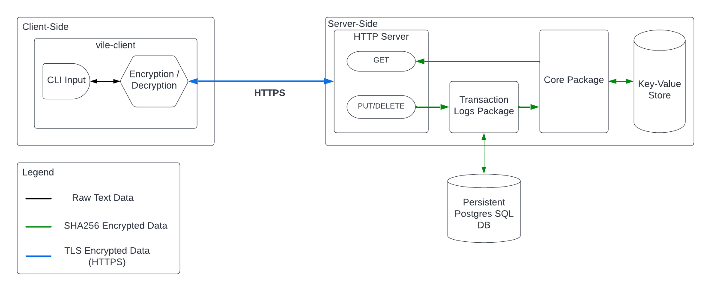

## vile

Command Line Interface (CLI) for vile servers with full client-side encryption

To see information on the vile key-value store, consult the [repository docs](https://github.com/RohitKochhar/vile)



### Synopsis


Command Line Interface (CLI) for vile servers

vile is used to easily and securely retrieve, store or delete entries from a remote vile server
	

### Options

```
      --config string   config file (default is $HOME/.vile.yaml)
  -h, --help            help for vile
```

### SEE ALSO

* [vile add](./docs/vile_add.md)	 - Adds a key value pair to remote vile server
* [vile check](./docs/vile_check.md)	 - Verifies the vile server is up and running
* [vile completion](./docs/vile_completion.md)	 - Generate the autocompletion script for the specified shell
* [vile delete](./docs/vile_delete.md)	 - Removes a value from remote vile server
* [vile get](./docs/vile_get.md)	 - Gets a value from remote vile server
* [vile rename](./docs/vile_rename.md)	 - Rename changes the name of the key used to store a value
###### Auto generated by spf13/cobra on 17-Nov-2022
